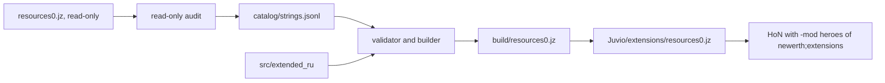
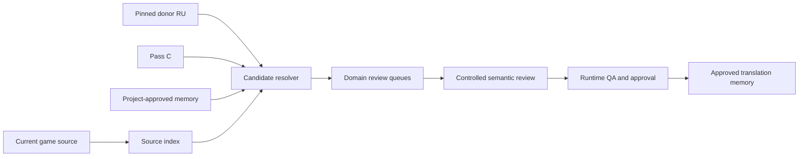

# Архитектура

## Границы системы

Проект разделён на источник данных, два runtime-слоя и операции доставки.

Builder не пишет в установленную игру. Этим занимается автономный Launcher:
он проверяет архив и основной game hash, сохраняет прежний extension и только
после этого атомарно устанавливает `extensions/resources0.jz`.

Последний мод K2 одновременно выбирает профиль настроек, поэтому запуск идёт
без `-config`: `-mod "heroes of newerth;extensions" -host_locale ru`.
`startup.cfg`, `game_settings_local.cfg`, `voice_config.cfg` и `bindings/shared.json` выбираются по
времени изменения только между обычным и русским профилями. Из ошибочно
созданного beta.9 профиля разрешено переносить лишь более свежий `login.cfg`,
но не его настройки по умолчанию. Более новый файл переносится после резервного
копирования заменяемого, содержимое конфигов не логируется. Затем Launcher
меняет только `host_locale`; прежнее значение сохраняется для Restore/Uninstall.

## Native Russian Locale

Движок использует соглашение об именах локали:

- `core_ru.resources` — font/resource manifest;
- `stringtables/<namespace>_ru.str` — значения по ключам;
- `host_locale=ru` — активная локаль;
- `ui/scripts/fe3/regions.lua` — список доступных кодов языка.

`core_en.resources` и `core_th.resources` побайтово идентичны, SHA-256 обоих:
`4fd71fe0d645460b541c3ae3ce6e6b70a809dfce5bfca06cf3bafb63a4f3e8bf`.
Это font maps на international TTF, а не ссылки на string tables. Загрузка
`*_ru.str` происходит по именованию файлов и выбранной локали.

`regions.lua` строит selector из `langCodes`, текст из `lang_<code>`, флаг из
`/ui/fe2/elements/flag_<code>.tga`, а смена языка вызывает
`SetHostLocale(value)`. Для RU override добавляет `ru` в оба возврата
`getLangCodes()`; исходный основной архив не меняется.

## Source of truth

Канонический формат — UTF-8 JSONL `catalog/strings.jsonl`. `strings.csv` —
зеркало для просмотра. Поля: `id`, `key`, `english`, `thai`, `source_file`,
`source_line`, `namespace`, `category`, `context`, `status`, `runtime_role`,
`thai_signal`, `protected_reason`, `protected_terms`, `locked_spans`, `russian`, `notes`,
`english_hash`, `classification_version`, `classification_source`.

`locked_spans` хранит canonical type, visible/source offsets и непосредственно
прилегающий HoN markup. Offset используется для аудита English source, но не
фиксирует позицию термина в русском предложении.

Повторяющиеся upstream-ключи фиксируются в отчёте, а каталог содержит одно
эффективное значение — последнюю запись, как ожидается от последовательной
загрузки таблицы. Builder повторно запрещает duplicate IDs.

## Multi-source candidate layer

`catalog/strings.jsonl` и текущий upstream остаются semantic source of truth.
Готовый русский текст больше не рассматривается как один монолитный источник.

- `translation/source_index.jsonl` хранит current value/hash/context один раз.
- `translation/candidate_index.jsonl` хранит origin/hash/reference, policy
  conflicts, structural flags и conservative recommended status без
  автоматического выбора финального русского.
- Фактические donor/Pass C values остаются в закреплённом PRE-D comparison
  dataset; resolver проверяет hashes перед выдачей значения.
- `translation/translation_memory.jsonl` содержит только явно утверждённые
  проектом значения. Approval действителен только при совпадающем source hash.
- Items, abilities, bosses и другие mechanics всегда требуют current entity
  context; хороший русский не доказывает свежесть механики.
- Domain queues определяют порядок human review, но не approval.

`tools/localization/resolve_candidate.py namespace:key` показывает current
source и все существующие candidates без изменения каталогов или runtime.

## Extended Juvio / Preact RU

Локальный frontend собирается в `preact/dist`. Native UI подключает один и тот
же `/preact/dist/index.html` с разными `ViewScope`. Для production нужен общий
i18n adapter, который получает `host_locale`, выбирает RU/EN и не переводит
данные protected-категорий. Собранные файлы кладутся в `src/extended_ru/preact/dist/`
и автоматически включаются builder-ом как override.

MOTD является исключением: native package грузит удалённый UI ZIP. Его стратегия
описана в `JUVIO_PREACT.md`.

## Builder

`tools/build_locale.py` генерирует шесть `*_ru.str`, `core_ru.resources`,
override `regions.lua` и необязательные файлы `src/extended_ru`. Проверяются:

- допустимые статусы и уникальные IDs;
- соответствие `english_hash`;
- запрет изменения `KEEP_EN`;
- полный multiset `{...}` (named и numeric arrays), printf и `${...}` tokens;
- полные HoN control codes (`^279`, `^o`, `^*`), `<...>` и literal escapes;
- неизменность обязательных inline `protected_terms`;
- пустые RU для `TRANSLATE`;
- значения, равные raw localization key;
- неизменность ожидаемой структуры `regions.lua`.

Archive output детерминирован и использует ZIP Zstandard method 93.
